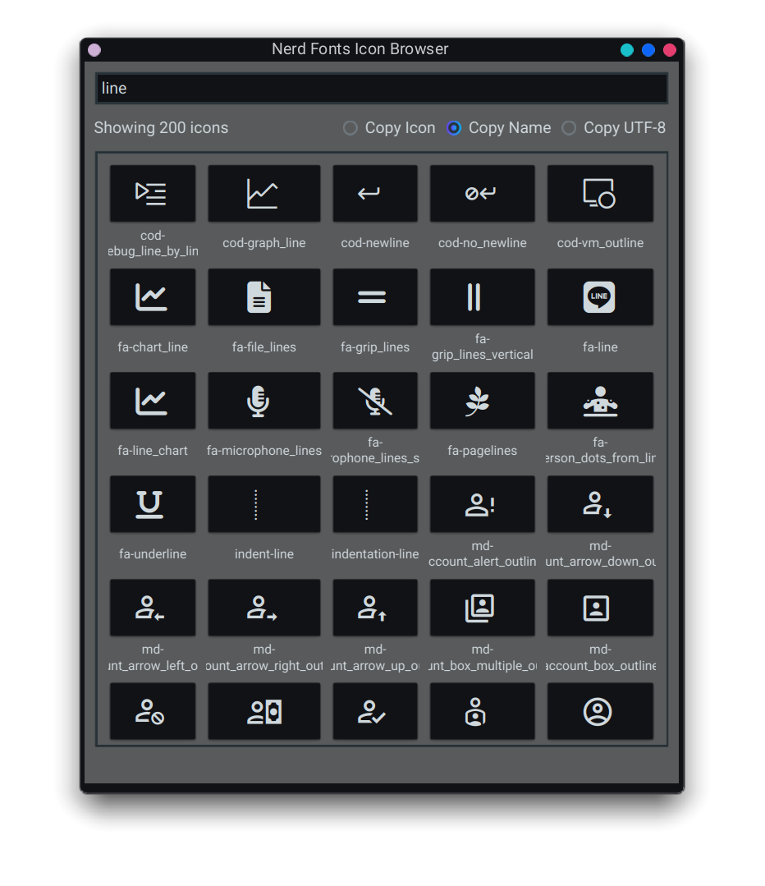

# Nerd Fonts Icon Browser

A Qt based desktop app for browsing and searching Nerd Fonts icons with copy paste support, so you don't have to open a web browser everytime you want to search nerd font icons. 

## Screenshot
Note: Color and theme might look different depending on your Qt theme.



## Download
Binary realeases are available [here](https://github.com/BaiduNano/nerd-fonts-icon-browser/releases).

## Compiling
Requirements:
- Qt6
- CMake
- C++20 compatible compiler, <b>clang</b> is recommended. 

## Building

```bash
cmake -B build
cmake --build build
```

## Usage

1. Place `glyphnames.json` from the [Nerd Fonts repository](https://github.com/ryanoasis/nerd-fonts/blob/master/glyphnames.json) in the application directory, or `.local/share/nf-icon-browser`
2. Run the application: `./build/NerdFontsIconBrowser`
3. Search for icons using the search bar
4. Click an icon to copy, or right-click for more options

## Copy Options

- **Icon**: copies the icon character
- **Name**: copies the icon class name
- **UTF-8**: copies the UTF-8 code
